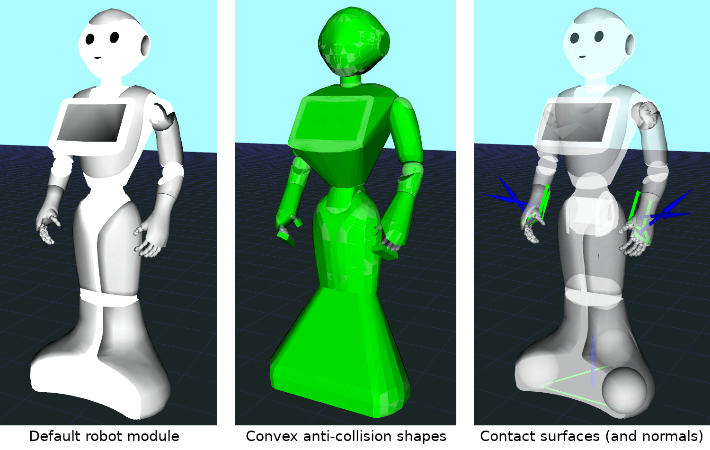

# Pepper robot description for [`mc_rtc`](https://jrl-umi3218.github.io/mc_rtc/)

This repository contains Pepper robot description ROS package customized for [`mc_pepper`](https://github.com/jrl-umi3218/mc_pepper) robot module used by [`mc_rtc`](https://jrl-umi3218.github.io/mc_rtc/) control framework.

The description package includes
* Robot kinematics and dynamics parameters defined in robot [URDF file](urdf/pepper.urdf)
* Anti-collision [convex shapes](convex)
* Contact surfaces (and normals) defined in [RSDF files](rsdf)

